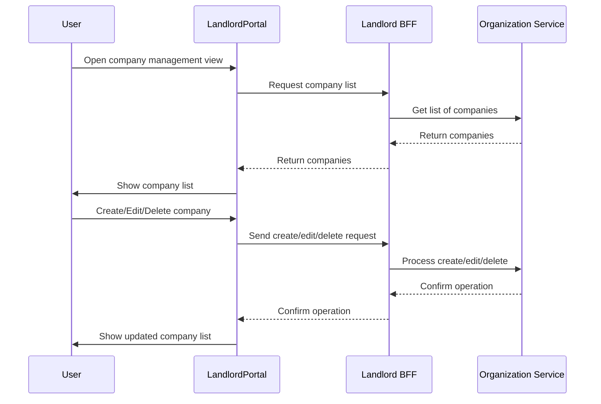

# Company Management Flow

This flow describes how a user manages companies within their organization: creating, editing, or deleting companies.

## Description
- User navigates to the company management view in the Landlord portal.
- The Landlord portal communicates with the Landlord BFF to retrieve and display the list of companies for the organization.
- User can create, edit, or delete companies.
- The Landlord BFF forwards requests to the Organization Service and returns the updated list to the portal.
