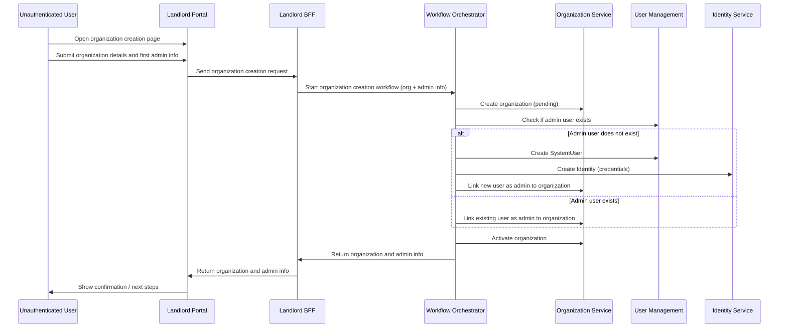

# Organization Creation Flow

This flow describes how an unauthenticated user creates a new Organization and specifies the first administrator. The system handles both new and existing users. The process is orchestrated by the Workflow Orchestrator (Durable Functions).

## Description
- Unauthenticated user opens the organization creation page in the Landlord portal.
- User submits organization details and first admin user info (email, name, credentials).
- The Landlord portal calls the Landlord BFF, which calls the Workflow Orchestrator to start the organization creation process.
- The Orchestrator creates the organization in a pending state, checks if the admin user exists, and creates the user and identity if needed.
- The Orchestrator links the user as admin to the new organization and activates the organization.
- Confirmation is returned through the BFF and shown to the user; future enhancements may include sending an invitation/confirmation email.
