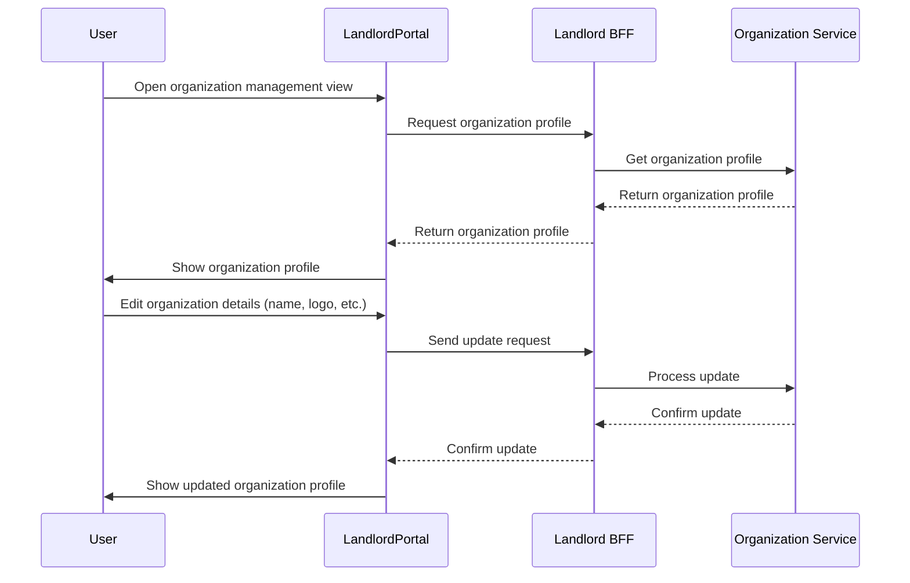

# Organization Management Flow

This flow describes how a user manages their organization, such as changing the name, logo, or other profile settings.

## Description
- User navigates to the organization management view in the Landlord portal.
- The Landlord portal communicates with the Landlord BFF to retrieve and display the organization's profile.
- User can edit details such as name and logo.
- The Landlord BFF forwards update requests to the Organization Service and returns the updated profile to the portal.
