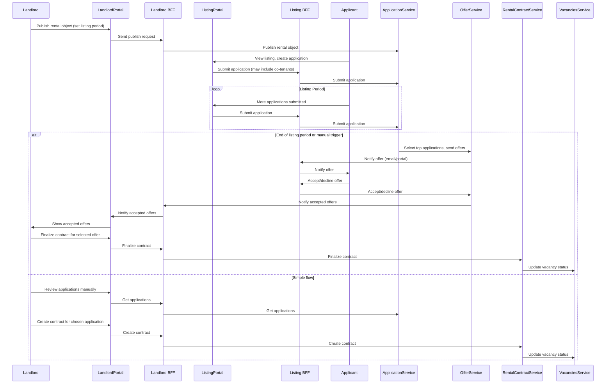

# Overbooking/Application/Contract Flow

## Notes
- Overbooking is allowed during the listing/application phase, but only one contract can be finalized for a given period.
- The process is configurable per company or rental object.
- The workflow for offers, acceptances, and contract creation is orchestrated and auditable.
- Double-booking is prevented at the contract finalization step.
- All portal/backend communication is routed through the appropriate BFF.
