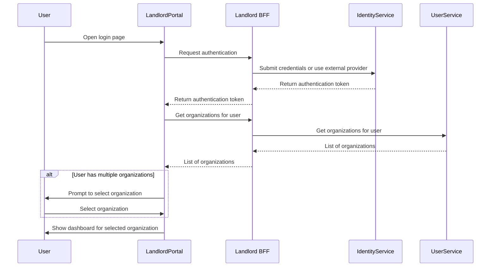

# User Authentication Flow

This flow describes how a user authenticates to the system using credentials or an external provider via the Landlord portal. If the user is connected to multiple organizations, they can select which one to manage.

## Description
- User opens the login page in the Landlord portal.
- The Landlord portal communicates with the Landlord BFF for authentication and organization retrieval.
- User authenticates using credentials or an external provider.
- Upon successful authentication, the system retrieves the organizations the user is connected to.
- If the user is connected to multiple organizations, they are prompted to select one.
- The dashboard for the selected organization is displayed.
