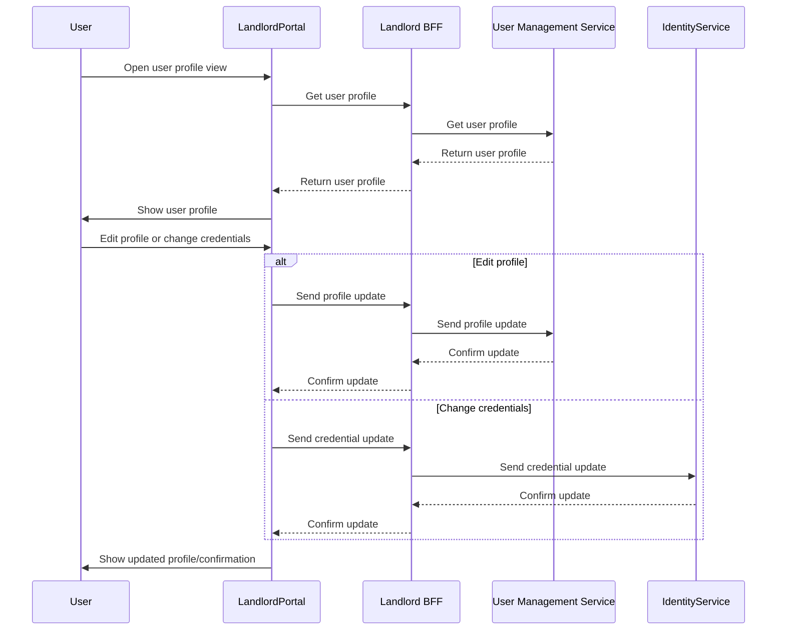

# User Management Flow

This flow describes how a user manages their own data and credentials in the system.

## Description
- User navigates to the user profile view in the Landlord portal.
- The Landlord portal communicates with the Landlord BFF to retrieve and display the user's profile.
- User can edit their profile data or change credentials (password, external login, etc.).
- Updates are processed by the User Management or Identity Service as appropriate, with all communication routed through the BFF.
