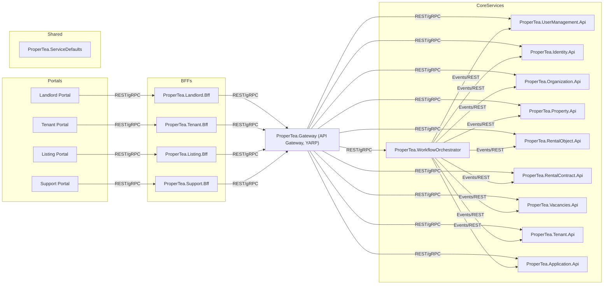

# Architecture Overview

This document provides a high-level technical overview of the ProperTea platform architecture. It includes:

- System Context Diagram
- Project Structure
- Network Flow and Gateway Placement

Each diagram is accompanied by a textual explanation. All diagrams are maintained in Mermaid format for easy updates and integration with documentation tools.

---

## 1. System Context Diagram

See [system-context.mmd](system-context.mmd) for the Mermaid source.



### Explanation
- **Portals**: User-facing web/mobile apps for different user roles.
- **BFFs**: Backend-for-Frontend services, one per portal, aggregate and shape data for their portal.
- **API Gateway**: Single entry point for all requests from BFFs, handles routing, authentication, and cross-cutting concerns. BFFs do not call services directly, but always go through the Gateway.
- **Core Services**: Microservices implementing business logic and workflows.
- **Shared**: Shared libraries and defaults used across services.

---

## 2. Network Flow and Gateway Placement

### Development/Local
- User → Portal (FE) → BFF → API Gateway (ProperTea.Gateway) → Microservices

### Production/Cloud
- User → Edge Gateway (e.g., Azure Front Door, Cloudflare, NGINX) → Portal (FE) or BFF
- BFF → API Gateway (ProperTea.Gateway)
- API Gateway → Microservices

**Edge Gateway** provides:
- SSL termination
- DDoS protection
- Web Application Firewall (WAF)
- Global load balancing
- Routing to the correct BFF/Portal

**Note:** The API Gateway is not exposed directly to the public internet; all requests should go through the edge gateway in production.

---

## 3. Project Structure

The solution is organized as follows:

```text
src/
  Identity/
    ProperTea.Identity.Api/
  LandlordPortal/
    ProperTea.Landlord.Bff/
  Orchestration/
    ProperTea.WorkflowOrchestrator/
  Organization/
    ProperTea.Organization.Api/
  ProperTea.AppHost/
  ProperTea.Gateway/
  Shared/
    ProperTea.ServiceDefaults/
  UserManagement/
    ProperTea.UserManagement.Api/
```

- Each domain service is in its own folder, with a clear separation of API/BFF projects.
- Orchestration (Durable Functions) is separated as ProperTea.WorkflowOrchestrator.
- BFFs (e.g., ProperTea.Landlord.Bff) are grouped with their respective portal context.
- Shared code (ProperTea.ServiceDefaults) is in a Shared folder.
- AppHost and Gateway are at the root of src, which is standard for Aspire-based solutions.

> As new services or portals are added, follow this structure for consistency and maintainability.
